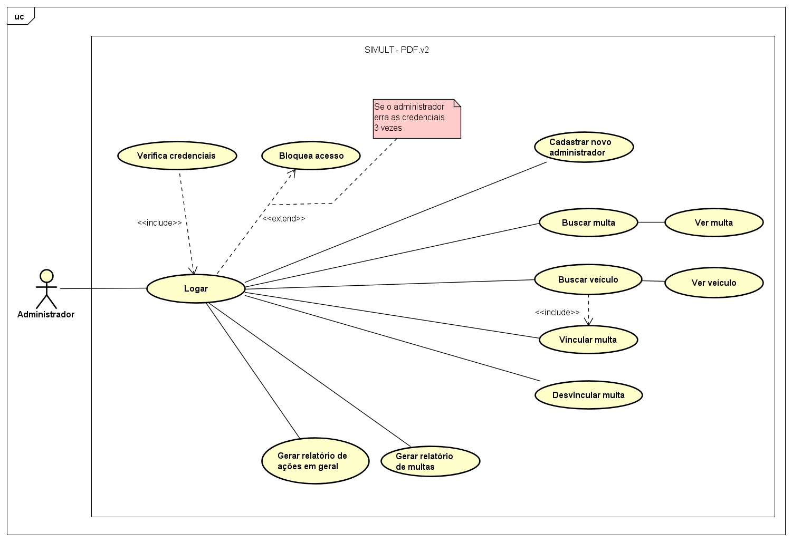
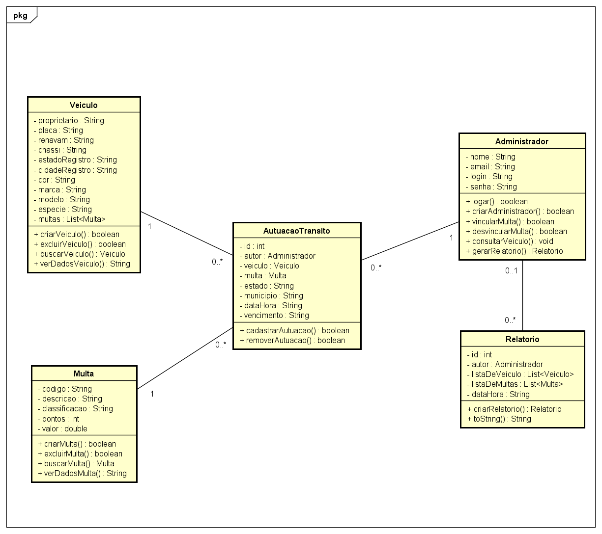
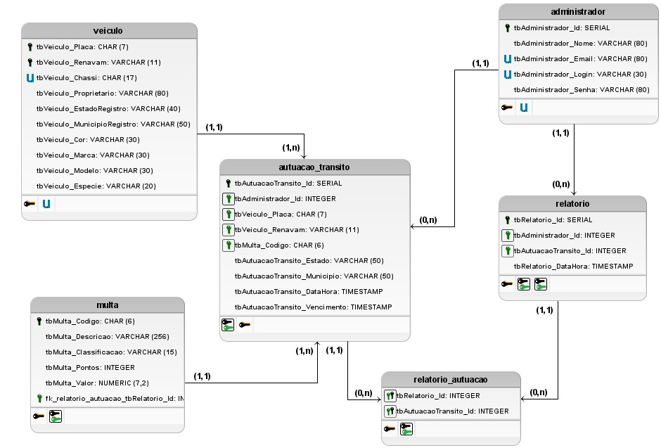

# SIMULT-PDF 2.0
> O SIMULT-PDF é um sistema de monitoramento/cadastramento de multas, desenvolvido inicialmente na linguagem Portugol, com o intuito de aprimorar a lógica de programação. O sistema elaborado na disciplina de Laboratório de Algoritmos e Estrutura de Dados II é simples e consiste na construção de um menu principal para auxiliar nas tomadas de decisões.
Embasado nisso, o SIMULT-PDF 2.0 é resultado do aprimoramento do sistema anterior, visando mais especificamente a parte do administrador. Dessa forma, são acrescidas novas funcionalidades - além da básica geração de multas e relatórios de trânsito - ao novo programa implementado na linguagem de programação Java.

## :spiral_notepad: Artigo
> https://www.overleaf.com/read/krgmdddvmjwb

## :clipboard: Requisitos

 - Funcionais
	 - [RF001] Criar novos usuário com permissão de administrador;
	 - [RF002] Administrador pode entrar no sistema;
	 - [RF003] Permitir que o administrador buscar por veículos;
	 - [RF004] O administrador pode visualizar os dados veículos; 
	 - [RF005] Permitir que o administrador realizar busca por multas; 
	 - [RF006] Permitir que o administrador visualize as informações de uma multa; 
	 - [RF007] O administrador pode vincular multas a veículos; 
	 - [RF008] Permitir que o administrador excluir multas em veículos; 
	 - [RF009] O administrador pode gerar relatório de multa vinculados no dia; 
	 
 - Não Funcionais
	 - [RNF001] Deve haver criptografia da senha dos usuários;
	 - [RNF002] Deve ser bloqueado acesso ao sistema caso as credenciais tenham sido colocadas 3 vezes seguidas erradas;
	 - [RNF003] O administrador deve ser notificado do sucesso ou fracasso da execução de uma operação;
	 - [RNF004] O sistema deve ser implementado em linguagem Java.

## :paperclip: Artefatos
- Diagrama de Caso e Uso

 - Diagrama de Classe

 - Banco de Dados: Modelo Lógico

## :hammer_and_wrench: Realização de Teste

 - Teste Estrutural
	 - Fluxo de Controle
	 - Fluxo de Dados
 - Teste Funcional
	 - Partição por Equivalência
	 - Analise do valor limite
	 
 - [x] Teste de Unidade
 - [x] Teste de Integração

## :family_man_woman_girl_boy: Equipe
:man_teacher: Professor: [Alysson Filgueira Milanez](https://github.com/alyssonfm).  
:woman_student: Integrante: [Geísa Morais Gabriel](https://github.com/Geisa-mg).  
:man_student: Integrante: [Leonardo Inácio Guilherme Dantas](https://github.com/LeonardoIGD).  
:woman_student: Integrante: [Lívia Beatriz Maia de Lima](https://github.com/liviabeatrizml).  
